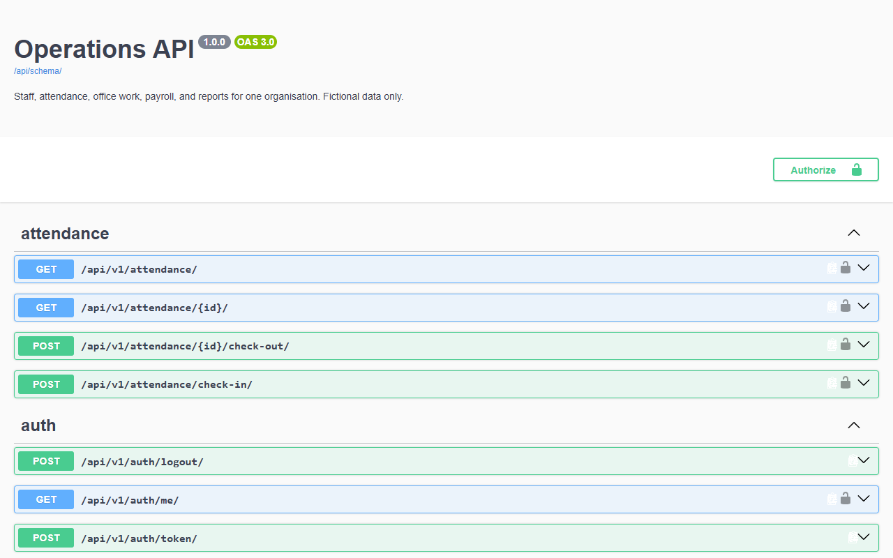
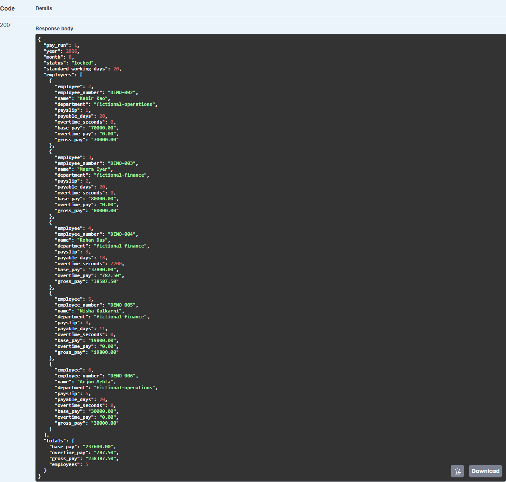

# Operations API

A Django REST API for running the staff side of a small organisation: staff records and roles, shifts and attendance, leave, office timesheets and overtime, monthly payroll and reports. Each installation serves one organisation. It is built from scratch with fictional data: a public counterpart to the private client systems its author has built for schools, clinics and small businesses.

[](https://github.com/code-kasha/operations-api/actions/workflows/ci.yml)
[](https://github.com/code-kasha/operations-api/releases/latest)
[](https://github.com/code-kasha/operations-api/pkgs/container/operations-api)
[](LICENSE)
[](https://www.python.org/)
[](https://docs.djangoproject.com/en/5.2/)

[Download v1.0.0](https://github.com/code-kasha/operations-api/releases/latest) · [API reference](docs/api.md) · [Permissions](docs/permissions.md) · [Payroll rules](docs/payroll.md) · [Deploy it yourself](docs/deployment.md) · [Contributing](CONTRIBUTING.md)



- **Staff and roles:** departments, employee records, and four business roles (operations admin, HR, manager, employee). Each role sees only what it should; hidden records return 404.
- **Attendance and leave:** dated shifts (including overnight), holidays, server-timed check-in and check-out, and paid or unpaid leave with reviews. Nobody approves their own requests.
- **Office work:** timesheets with task intervals, submission and review, and separately approved overtime.
- **Payroll:** salary structures, working-day pro-rating for joiners, absences and unpaid leave, multiplier or flat-rate overtime paid once, and pay runs that lock. Gross pay only.
- **Reports:** monthly attendance summary, payroll register and headcount, scoped by role.
- **Sample data:** one command loads a fictional office with a month of history and a locked pay run.
- **API-first:** JWT authentication with rotating refresh tokens, Swagger UI, ReDoc and a committed OpenAPI schema.
- **Transactional and audited:** every change goes through a service in one transaction, recorded in an activity log.

> **Status:** complete as of v1.0.0 and not actively maintained. It works as-is; fork it, reuse it, grow it.
>
> **Fictional data only.** Every name, department and figure is invented. Payroll calculates gross pay and makes no statutory compliance claims (no PF, ESI, professional tax or TDS).

## Quick start

Clone the repository; every command below runs from its folder:

```sh
git clone https://github.com/code-kasha/operations-api.git
cd operations-api
```

**With Docker**, with Docker Desktop or Docker Engine running:

```sh
docker compose up --build -d
docker compose exec api python manage.py load_sample_data --password 'choose-a-strong-password'
```

This is a disposable local demo on SQLite; `docker compose down` removes it and its data.

**With Python.** Requires Python 3.13 and [uv](https://docs.astral.sh/uv/):

```sh
uv sync --frozen
uv run python manage.py migrate
uv run python manage.py load_sample_data --password 'choose-a-strong-password'
uv run python manage.py runserver
```

Data stays in the ignored `db.sqlite3` file. The password must pass Django's password checks, so pick something long.

Then open [Swagger UI](http://127.0.0.1:8000/api/docs/):

1. Call `POST /api/v1/auth/token/` with `demo.hr` and your password, and copy `access`.
2. Click **Authorize** and paste it.
3. Try `GET /api/v1/reports/payroll-register/` with last month's year and month.



The sample accounts are `demo.admin`, `demo.hr`, `demo.manager`, `demo.employee`, `demo.analyst` and `demo.coordinator`. [Sample data](docs/reports.md#fictional-sample-data) explains what each can see and do. For the admin site, create a superuser with `python manage.py createsuperuser`; business records are read-only there.

To start empty instead, skip `load_sample_data` and follow [staff onboarding](docs/api.md#staff-onboarding).

## How it works

Every write follows `View → Serializer → Service → Database`. Serializers check the shape of the request. Services recheck permissions, lock what they change, and write the record and its activity-log entry in one transaction. Querysets are filtered by role, so a record you cannot see returns 404 and a visible record you cannot change returns 403. The [permission matrix](docs/permissions.md) lists every rule.

| Area | Rules |
| --- | --- |
| Staff | [Permissions](docs/permissions.md), [staff onboarding](docs/api.md#staff-onboarding) |
| Attendance and leave | [Attendance](docs/attendance.md): the calendar, clocking, day statuses and leave transitions |
| Office work | [Offices](docs/offices.md): timesheets, overtime and the boundary with payroll |
| Payroll | [Payroll](docs/payroll.md): working days, overtime methods, rounding and locking |
| Reports and sample data | [Reports](docs/reports.md) |

**What payroll does and doesn't do.** Base pay is `monthly base × payable days / standard working days`. Standard working days are the month's weekdays minus holidays, and payable days are the days employed minus absences and unpaid leave. Overtime is paid once, from approved requests, at a multiplier or a flat rate chosen per salary structure. Money is rounded half-up to the paisa. Locked pay runs never change. There are no deductions, net pay, payslip PDFs or statutory rules. [Payroll improvements](docs/payroll-improvements.md) lists what a complete product would add.

**Sectors.** `ORGANISATION_SECTOR` is `office` by default. The school and clinic modules are not implemented; with those sectors, only the shared core runs.

## Deploy it yourself

The Docker image runs in production mode on PostgreSQL behind an HTTPS proxy, and refuses to start if its settings are unsafe. [docs/deployment.md](docs/deployment.md) covers the settings, migrations, a hosted demo on Render and Neon, and releases. The production image was verified against PostgreSQL 17 on 27 September 2026.

Operations API uses Django 5.2 LTS, whose security support ends in April 2028. Upgrade Django before running a fork publicly after that.

## For developers

```text
config/                 settings (base, development, test, production), URLs, health
apps/accounts/          user model, JWT login, refresh and logout
apps/staff/             departments, employees, roles, activity log
apps/attendance/        shifts, assignments, holidays, clocking, leave; shared day statuses
apps/offices/           timesheets, task entries, overtime requests
apps/payroll/           salary structures, working-day calculations, pay runs, payslips
apps/reports/           attendance summary, payroll register, headcount
apps/sample_data/       load_sample_data and the demo-only reset_demo command
deploy/demo-start.sh    the hosted demo's start command
tests/                  behavioral tests; fictional data only
schema.yml              the committed OpenAPI contract
```

The checks, which CI runs on every push and pull request along with a Docker build and smoke test:

```sh
uv run ruff check .
uv run ruff format --check .
uv run python manage.py check
uv run python manage.py makemigrations --check --dry-run
uv run pytest
uv run python manage.py spectacular --validate --fail-on-warn --file schema.yml
git diff --exit-code -- schema.yml
```

Tests and CI use SQLite by design; production uses PostgreSQL. [Architecture](docs/architecture.md) records the decisions and boundaries, and [AGENTS.md](AGENTS.md) the rules the code keeps.

## Contributing, license and credit

Operations API is complete as of v1.0.0 and not actively maintained: issues and pull requests may go unanswered, so fork it freely. [CONTRIBUTING.md](CONTRIBUTING.md) explains the checks. The code is under the [MIT License](LICENSE).

Created by Akash Damle ([@code-kasha](https://github.com/code-kasha)).
